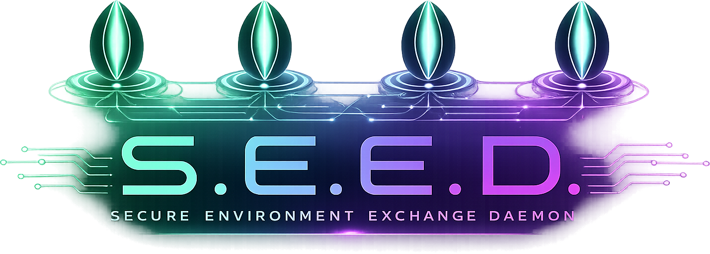

Public **release artifacts** for **S.E.E.D. (SEED Sync)** — the Linux tarball, the
macOS app bundle, and the Windows installer. This repo holds binaries only; the
source lives in the source repo.

## How it works
- Each release is a **GitHub Release** tagged `vX.Y.Z`, carrying every platform's
  assets:
  - `seed-sync-<ver>-linux-x86_64.tar.gz` — Linux tarball.
  - `seed-sync-<ver>-macos-universal.tar.gz` — macOS app (Apple Silicon + Intel).
  - the Windows installer (`...-windows-x86_64.msi`).
- The Linux and macOS assets are published **automatically** by the `seed-sync-gtk`
  **release workflow** on a `v*` tag; the Windows installer is attached to the same
  release by the Windows side.
- It's **public on purpose**: the install/update tooling downloads assets with no
  authentication. Publishing *to* this repo requires a token (`SEED_BINARIES_TOKEN`,
  stored as a secret in the source repo); downloading does not.

## Install / update / uninstall (Linux & macOS)

Per-user, **no root**. One command — it detects your OS, installs, updates, or
removes (and prompts for what to do if something's already there):

```sh
curl -fsSL https://steeb-k.github.io/seed-install.sh | sh
```

Non-interactive: append `-s -- install` (or `update` / `remove`) after `sh`.

After the first install, manage it locally with the `seed-sync` command:

```sh
seed-sync --update          # check + apply a newer release (a daily timer does this too)
seed-sync --status          # installed/latest version + daemon/agent state
seed-sync --uninstall       # add --purge to also delete your app data
```

### Linux
Requires **GTK 4.10+, libadwaita 1.4+, libdbus-1** already on the system
(`--install` checks and tells you if anything's missing). Installs binaries to
`~/.local/bin`, runs the daemon as a `systemd --user` service (auto-starts at
login), and enables a daily auto-update timer. Launch **S.E.E.D.** from your app
menu. Data lives in `~/.local/share/seedsync`.

### macOS
- **macOS 14 (Sonoma) or later**, **Apple Silicon and Intel** — the asset is a
  **universal2** binary (one download runs natively on both).
- **Self-contained:** GTK4 + libadwaita and their dependencies are bundled in the
  app, so **no Homebrew or other runtime is required**.
- **No Gatekeeper prompt, no notarization:** the app is ad-hoc signed, and fetching
  it with `curl | sh` (rather than a browser download) doesn't set the quarantine
  flag, so it launches without an "unidentified developer" block.
- Installs **`SEED Sync.app`** to `~/Applications` (shows in Launchpad / Spotlight /
  Finder, with a Dock icon) and symlinks `seed-sync` / `seed-daemon` / `seed-cli`
  into `~/.local/bin`. The daemon, daily updater, and tray GUI run as per-user
  **launchd agents**. Your data lives in `~/Library/Application Support`; the master
  seed is stored in the **Keychain**. Logs are in `~/Library/Logs/SeedSync`.
- Install options: `--no-auto-update` (skip the daily update agent),
  `--no-gui-autostart` (don't launch the tray GUI at login). `--uninstall --purge`
  also removes `~/Library/Application Support` data.
- If you downloaded the `.tar.gz` in a **browser** instead of via `curl | sh`,
  macOS will quarantine it; clear it with
  `xattr -dr com.apple.quarantine "<unpacked folder>"`.

> **Note:** `~/.local/bin` must be on your `PATH` to run `seed-sync` / `seed-cli`
> directly. Most Linux desktops add it automatically; on macOS add
> `export PATH="$HOME/.local/bin:$PATH"` to your shell profile if it isn't there.

### Windows
Download the `...-windows-x86_64.msi` asset from the latest release and run it
(installs the service + Start-menu shortcut and registers a daily update task).

## Maintainers
- **Do not commit source or large files here** — only release assets, attached via
  Releases (not committed to the tree).
- Releases are cut by tagging `vX.Y.Z` in `seed-sync-gtk` (which must match its
  `Cargo.toml` version). The Linux + macOS jobs publish here automatically; the
  Windows MSI is built/signed and attached from the Windows side. See
  `docs/{linux,macos,windows}-packaging.md` there.
- **macOS minimum-version note:** the universal asset's floor is set by the GTK
  dylibs bundled at build time — i.e. the macOS version of the build machine /
  runner. Build the release on the **`macos-14`** runner to target macOS 14
  (Sonoma); a newer build host raises the minimum (e.g. building on macOS 26 yields
  an arm64 slice that needs macOS 26).
